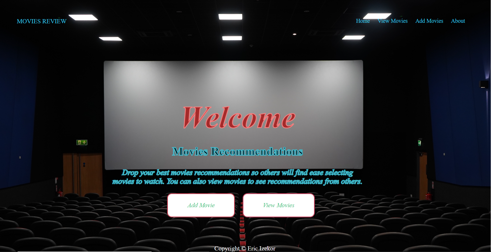
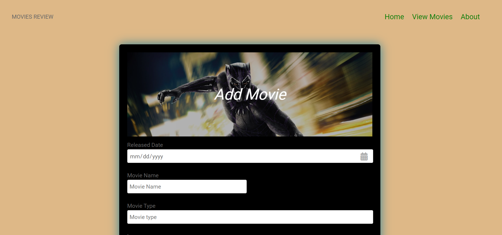
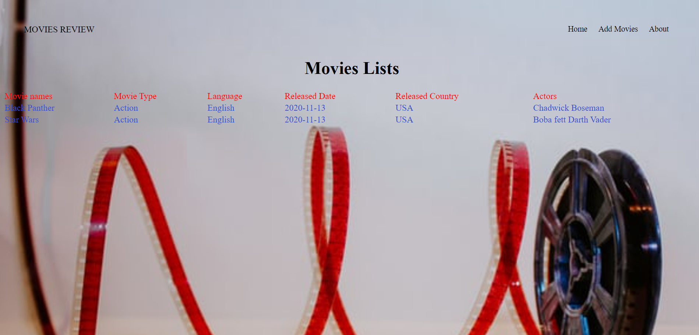

# Overview:
This program collects movies recommendations from people and also allow people to view movies submitted by other users of the web app. It Uses Python 3.8.5 with Visual Studio Code, Django and Github.

# Development Enviroment:
* Visual Studio Code
* Python 3.8.5
* Django

# Execution:
* To execute the program: 'mywebapp'
* create a virtual environment.
* type 'python manage.py runserver' on the terminal.

# Sample Output:

# Useful Websites:
* [Django reference](https://www.djangoproject.com/)